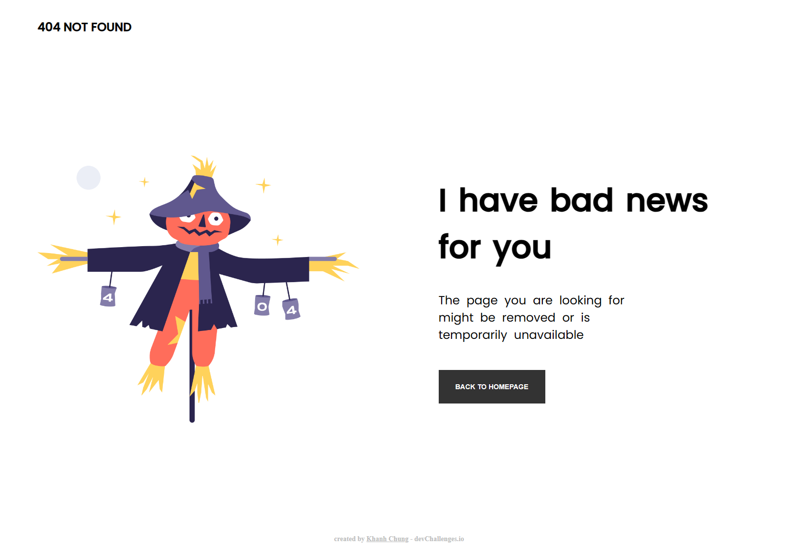
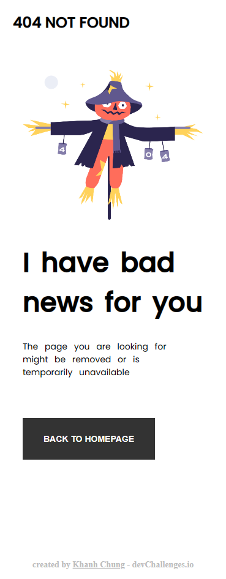

<!-- Please update value in the {}  -->

<h1 align="center">404 Not Found</h1>

   Solution for a challenge from  <a href="https://devchallenges.io/" target="_blank">Devchallenges.io</a>.

  <h3>
    <a href="https://github.com/craftzmask/404-not-found">
      Solution
    </a>
     | 
    <a href="https://devchallenges.io/challenges/wBunSb7FPrIepJZAg0sY">
      Challenge
    </a>
  </h3>

<!-- TABLE OF CONTENTS -->

## Table of Contents

- [Overview](#overview)
  - [Built With](#built-with)
- [Features](#features)
- [Contact](#contact)
- [Acknowledgements](#acknowledgements)

<!-- OVERVIEW -->

## Overview

#### Main Page

#### Mobile Page

Introduce your projects by taking a screenshot or a gif. Try to tell visitors a story about your project by answering:

- Where can I see your demo?
  - Currently, I don't have demo link for it.
- What was your experience?
  - Even though this is just a simple web page but building it from scratch using only HTML and CSS taught me a lot about how to construct HTML and using Flexbox to do responsive design.
- What have you learned/improved?
  - Mostly CSS skills (Flexbox)
- Your wisdom? :)
  - CSS is not that bad, just it a try, you will learn it well.

### Built With

<!-- This section should list any major frameworks that you built your project using. Here are a few examples.-->

- HTML
- CSS

## Features

<!-- List the features of your application or follow the template. Don't share the figma file here :) -->

This application/site was created as a submission to a [DevChallenges](https://devchallenges.io/challenges) challenge. The [challenge](https://devchallenges.io/challenges/wBunSb7FPrIepJZAg0sY) was to build an application to complete the given user stories.
- <strong>User story</strong>: I can see a page following the given design

## Acknowledgements

<!-- This section should list any articles or add-ons/plugins that helps you to complete the project. This is optional but it will help you in the future. For exmpale -->

- [CSS-Tricks](https://css-tricks.com/snippets/css/a-guide-to-flexbox/)

## Contact

- GitHub [craftzmask](https://github.com/craftzmask)
